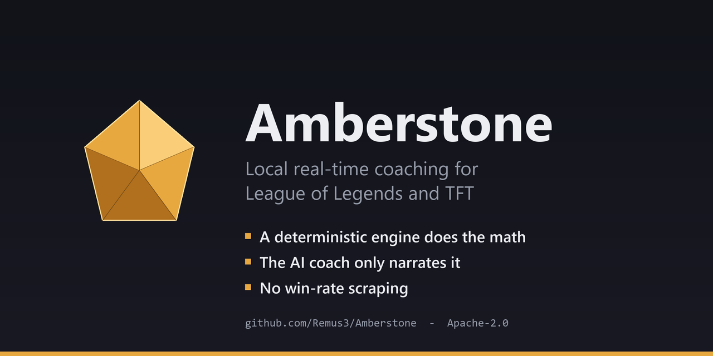

# Amberstone



A local, real-time coaching companion for League of Legends and Teamfight
Tactics. A deterministic engine does the item and damage math; the AI coach only
narrates what that math already decided.

[](https://github.com/Remus3/Amberstone/actions/workflows/ci.yml) [](https://github.com/Remus3/Amberstone/actions/workflows/docs-guards.yml) [](./LICENSE) [](./.github/workflows/ci.yml) [](#limitations) [](https://remus3.github.io/Amberstone/atlas.html)

It watches the match you are actually in through the Riot Live Client API and
turns it into short, situation-specific advice on a dashboard and an in-game
overlay.

It is a single-machine personal build: one Windows PC runs the game, the engine,
the coach and the overlay together, with no hosted version and no installer.

**[Explore the codebase as a map](https://remus3.github.io/Amberstone/atlas.html)**
draws the project's main components as one interactive page, with source files
orbiting the component they belong to. It runs in the browser and loads nothing
from the network.

## Contents

| | |
|---|---|
| [What makes it different](#what-makes-it-different) | why the math runs before the model, and what that buys |
| [What it does](#what-it-does) | the features, and the modes they run in |
| [Quickstart](#quickstart) | from a fresh clone to the dashboard on one Windows PC |
| [How it works](#how-it-works) | the pipeline in one diagram, plus the port map |
| [Daemon Slayer build engine](#daemon-slayer-build-engine) | the engine everything else is built around |
| [Riot policy stance](#riot-policy-stance) | what was removed or fenced to stay inside Riot's third-party rules |
| [Limitations](#limitations) | what it cannot do, and why |
| [Status](#status) | what is done, what is in flight, what is blocked on a live game, and what is deliberately not being built |
| [How the work gets done](#how-the-work-gets-done) | multi-agent Claude Code, the headless background lanes, and the cross-repo note channel |
| [Data sources and credits](#data-sources-and-credits) | the public projects the game data comes from |
| [Documentation map](#documentation-map) | every other document, and who each is written for |

---

## What makes it different

Most build advice is a popularity contest: an item is recommended because many
players bought it in many games. This project takes the other route.

- **The math runs first, locally.** A build calculator scores champion x item x
  target combinations from real game numbers - damage per second, effective
  HP, ability burst, healing throughput - and the LLM coaching
  agent reasons *over that output* rather than guessing. An item suggestion
  reflects your actual matchup, not a tier list.
- **No win-rate scraping for builds.** Item and build recommendations never
  come from other players' win rates. They come from computed quantities,
  which is also why the engine can answer for matchups too rare to have a
  sample size. Two narrow features do read published statistics - a
  bot-lane duo-synergy grid and ARAM Mayhem augment priors - and both are
  credited below.
- **Your own history, not a tracker's.** Matches land in a local SQLite archive
  with full timeline data, so champion select reads history you own.
- **Offline at request time.** The engine makes no network calls and has no
  per-query cost, so it can be asked thousands of questions per game.

---

## What it does

- Keeps a running picture of the match from the game client's own local feed -
  gold, level, KDA, items on both teams - polled about once a second, and turns
  it into situation-specific tips.
- Reads the screen with OCR first, and escalates to an AI vision model only for
  what OCR misses.
- Suggests picks in champion select from your own match history, filtered by the
  enemy team composition; ban and counter hints come from the engine's own 1v1
  damage math.
- Writes runes into the League client automatically, through the client's own
  local LCU (League Client API) endpoint.

Modes: Summoner's Rift, ARAM including its event variants, Arena, and Teamfight
Tactics. A fifth path covers Riot's rotating game modes - URF, One for All,
Nexus Blitz and their siblings - which is wired and enabled, but only exercised
when Riot actually rotates one of them in.

---

## Quickstart

There is no hosted version and no packaged release; it runs from a checkout on
the same Windows PC as the game.

1. Install Python 3.12 or newer (CI tests on 3.12) and
   [Git LFS](https://git-lfs.com/), then clone:

   ```text
   git clone https://github.com/Remus3/Amberstone.git
   cd Amberstone
   git lfs install --local
   git lfs pull
   ```

   Without LFS the precomputed laning tables arrive as pointer files and that
   coach falls back to a live model call.
2. Run `install.bat`. It installs `requirements.txt`, creates the runtime
   directories, and asks for an Anthropic API key in `API-Key-Claude.txt`
   (gitignored). A Riot developer key is optional and goes in
   `API-Key-Riot.txt` (also gitignored); it is only needed for Match-V5 history.
3. Run `start.bat`, then open the dashboard on port `:8888`. It serves plain
   HTTP until a local certificate exists (`tools/regen_rc_cert.ps1` makes one),
   then HTTPS.

Contributors: run `python scripts/install_hooks.py` first. The git hooks are
the authoritative commit and push gates, and a fresh clone has none.
Day-to-day procedures - restart, health checks, scheduled tasks - are in
[`docs/OPERATIONS.md`](./docs/OPERATIONS.md).

---

## How it works

A Python service polls the Live Client API about once a second. The build engine
answers first with local math, and its output is injected into every coaching
call. The coach fires roughly every 8 seconds, and immediately on kills and
health swings.

```text
  Riot Live Client API :2999         screen capture
  gold / level / items / KDA               |
              |                            v
              |                   OCR first, AI vision
              v                   only on a miss  :8889
  local reader, about 1 Hz  <--------------+
              |
              v
  +----------------------------------------------------+
  |  Daemon Slayer build engine           :8860        |
  |  computed DPS / EHP / burst / healing math         |
  |  no network calls, no per-query cost               |
  +----------------------------------------------------+
              |  scored builds, counters, item deltas
              v
  LLM coaching agent
              |
              v
  web dashboard :8888  and  in-game Electron overlay
```

| Port | Service |
|---|---|
| :8888 | Web dashboard (HTTPS once a local certificate exists) |
| :8889 | Vision server |
| :8890 | Agents supervisor (proxied by the dashboard) |
| :8891 | Agents WS relay |
| :8895 | Mission Control (separate process, JSON API only, no web page) |
| :8860 | Daemon Slayer build engine |
| :8861 | Daemon Slayer match-history MCP server |
| :2999 | Riot Live Client API (the game client's own feed) |

---

## Daemon Slayer build engine

The engine everything else is built around. It is a build calculator and item
optimizer in one: it models the full champion roster and every item the shop
actually offers in the modes it scores, including the mode-specific pools, and
picks one of seven scoring modes automatically from the champion's role.

| Role | What it optimizes |
|---|---|
| Carry (ADC) | Auto-attack damage per second |
| Tank | Effective HP against the enemy team's damage mix |
| Bruiser | A per-champion blend of damage and durability |
| Mage | Ability damage at the champion's cast cadence |
| Assassin | Total burst inside a combo window |
| Enchanter | Healing and shielding throughput |
| On-hit (AP) | Ability damage plus on-hit auto damage in one score |

Champions do not fit one formula, so a registry of per-champion mechanic
overrides handles the unusual kits - form swaps, recast windows, resource bars,
revives - and covers most of the roster.

It is self-contained and readable on its own: the scoring code, its per-champion
registries and its test suite all live under
[`agents/daemon_slayer/`](./agents/daemon_slayer/), and the depth reference is
[`docs/DAEMON_SLAYER.md`](./docs/DAEMON_SLAYER.md).

---

## Riot policy stance

The project is built to sit inside Riot's published third-party application
rules, and treats them as engineering constraints with tests behind them rather
than as a note in a README. Measured against those rules, the codebase has:

- **Removed enemy cooldown tracking.** The enemy summoner-spell tracker and the
  per-player summoner and ultimate cooldown ledger were deleted. A threat cell
  that used to show an enemy ability's cooldown was rebuilt to carry only static
  kit facts the client already shows (which ability, how long its crowd control
  lasts) and no enemy cooldown number.
- **Stopped live imperatives and power-spike alerts.** In game, decision points
  are captured silently and reviewed after the match instead of being pushed as
  "do this now" notifications.
- **Anonymised champion select.** Non-party summoner names are replaced at the
  producer with positional labels, so every consumer inherits it.
- **Refused Riot's Brawl mode.** It is routed to an unsupported mode that loads
  no coach, ahead of any default.
- **No TFT win-rate or augment-placement statistics.** TFT advice comes from the
  player's own board.

Each removal left an inverted guard test that turns red if the banned surface
comes back. Three questions are still open and are tracked rather than assumed
settled, all for Riot developer relations: the screen-capture vision path,
declaring LCU use in a Riot application, and how in-game build recommendations
are treated. The plan, with the rule each item answers to, is
[`docs/OVERLAY_COMPLIANCE_PLAN.md`](./docs/OVERLAY_COMPLIANCE_PLAN.md).

The project runs on a personal Riot API key and is not a registered or
approved Riot product; see the disclaimer at the end of this page.

---

## Limitations

- **Windows only, one machine.** Game, coach, dashboard and overlay share a PC.
  A Python service runs under a supervisor, serves the dashboard over local
  HTTPS to a browser, and drives an Electron overlay for in-game display; the
  procedures for running it live in
  [`docs/OPERATIONS.md`](./docs/OPERATIONS.md).
- **Bring your own API key.** The coaching and vision paths call a third-party
  model API. Without a key those paths stay off and the local math still works.
- **Riot's API limits what is knowable.** Some event modes return no match
  history through the public API, and some in-game state has no API at all -
  which is exactly why the vision path exists.
- **Not affiliated with Riot Games.** See the disclaimer below.

---

## Status

As of 2026-10-09. This is a summary; [`ROADMAP.md`](./ROADMAP.md) is the live
list of open work.

**Working now.** The full loop runs end to end: the live reader, the build
engine, the coach, the dashboard and the overlay. The build engine and
champion-select advice cover the League modes; TFT runs on the vision and
coaching paths. Automatic rune writing, the local match archive with timeline
data, and the Electron overlay are shipped.

**In flight.** The largest open program is taking the model out of the hot path:
precompute the common coaching decisions as plain engine lookups so live LLM
calls trend toward zero, leaving the language model for what genuinely needs
judgement. Alongside it run a UI redesign, a standing per-file hardening audit
that files each finding as its own tracked item, and counter-build hints that
are code-complete and waiting on a live game to confirm.

**Blocked on a real game.** Render cadence, overlay timing and event ordering can
only be settled while a match is running, so those items are tracked apart in
[`docs/LIVE_GAME_GATED_SYNC.md`](./docs/LIVE_GAME_GATED_SYNC.md) rather than
closed on synthetic evidence.

**Deliberately not being built.** No win-rate-driven build advice and no
machine-learned win predictor - the engine exists so neither is needed. No replay packet parsing as a
shipping feature, since the format is re-obfuscated each patch. No replacement
for the in-game HUD: the Live Client API exposes no cooldowns, buffs, wards or
XP, so the overlay augments the HUD and cannot stand in for it. No hosted
service, no installer.

Open work lives in [`ROADMAP.md`](./ROADMAP.md), the longer-horizon queue in
[`BACKLOG.md`](./BACKLOG.md), and the completion record in
[`docs/LEDGER.md`](./docs/LEDGER.md).

---

## How the work gets done

The project is written and maintained by one person directing Claude Code
agents. An attended session plans and merges; the building is done by
sub-agents in isolated git worktrees, and a separate read-only verifier has to
pass a change before it counts as done. The producer never grades its own work.

**Headless lanes.** Maintenance runs as mutually exclusive lanes, one holder at
a time, each in its own git worktree, so nothing edits the checkout a person is
reading. A lane is a single `claude -p` worker fed a tracked prompt document
from [`tools/`](./tools/).

**One item per cycle.** A research lane files work items carrying an id, cited
`file:line` evidence and an acceptance check; a queue lane does exactly one of
them and exits, and a driver re-fires it. A crash loses one item rather than a
night's work, and each item arrives as its own reviewable commit.

**Background, not in the way.** Lanes and other headless runs start through one
spawn helper that fails closed, opens no visible console, caps itself at 120
runs per rolling 24 hours, and writes a live status file, so long work reports
progress while it runs instead of only at the end.

**Cross-repo note sync.** This repository is one of several on the same
machine that coordinate through plain-text notes. Each repository has a
gitignored inbox; a note is delivered by writing into the recipient's inbox and
confirmed by re-hashing the delivered copy. As of this pass the channel runs
end to end without a person relaying: a scheduled responder answers incoming
notes headlessly every few minutes, but only while a hand-written, expiring
agreement arms it, and a STOP file overrides it at any point. The channel
conventions are in [`docs/CHANNEL.md`](./docs/CHANNEL.md). The other
repositories are referred to only by short codes; their names and paths live
in per-machine config that is never committed, and a pre-push sweep checks
outgoing diffs for them.

The control plane and the lane roster are described in
[`docs/MISSION_CONTROL_PLAN.md`](./docs/MISSION_CONTROL_PLAN.md).

---

## Data sources and credits

Game data comes from these public sources:

- **Riot Data Dragon** - champion, item and rune data
- **CommunityDragon** - supplementary and pre-release game data
- **Meraki Analytics** - structured item and champion stat extracts
- **The League of Legends Wiki** - mechanic reference for kits the structured
  data does not describe
- **Riot APIs** - Match-V5 for match history, and the Live Client API the game
  client serves locally during a match
- **lolmath** - the data chunk the ARAM balance modifiers are extracted from
- **101.qq.com** - duo-synergy win-rate rows for the bot-lane pairing grid
- **An external augment-statistics endpoint** - ARAM Mayhem augment priors,
  fetched on demand and not cached in the repository

Each source keeps its own terms; [`NOTICE`](./NOTICE) records them one by one.

---

## Documentation map

The repository root mixes documents written for people with working files the
maintenance agents keep between sessions. The lists below separate the two.

For readers:

- [`docs/ARCHITECTURE.md`](./docs/ARCHITECTURE.md) - component map and data flow
- [`docs/DAEMON_SLAYER.md`](./docs/DAEMON_SLAYER.md) - build engine deep reference
- [`docs/API.md`](./docs/API.md) - dashboard HTTP API
- [`docs/adr/`](./docs/adr/) - architectural decision index
- [`agents/daemon_slayer/`](./agents/daemon_slayer/) - the build engine itself, with its own tests
- [`ROADMAP.md`](./ROADMAP.md) - open work
- [`atlas.html`](./atlas.html) - the repository drawn as an interactive map, served at [remus3.github.io/Amberstone/atlas.html](https://remus3.github.io/Amberstone/atlas.html). Generated from the git index by [`tools/atlas_build.py`](./tools/atlas_build.py) (`--check` reports a stale page); it loads its dashboard snapshots from [`atlas/snapshots/`](./atlas/snapshots/) and its colours from `ops/fleet_kit/tokens.css`, so use the served link or open it from a local checkout - GitHub's file view shows only its source

For anyone reporting or contributing:

- [`.github/CONTRIBUTING.md`](./.github/CONTRIBUTING.md) - what a useful issue looks like, and why a pull request may not be merged
- [`.github/SECURITY.md`](./.github/SECURITY.md) - how to report a vulnerability privately
- [`.github/CODE_OF_CONDUCT.md`](./.github/CODE_OF_CONDUCT.md) - the short version: be civil, be specific

For maintenance and coding agents:

- [`CLAUDE.md`](./CLAUDE.md) - agent operating context
- [`docs/MISSION_CONTROL_PLAN.md`](./docs/MISSION_CONTROL_PLAN.md) - the headless-lane control plane and the lane roster
- [`docs/OPERATIONS.md`](./docs/OPERATIONS.md) - run, restart, and maintenance procedures
- [`scripts/`](./scripts/) - the secondary launchers (restart, kill, debug start, dev bootstrap) and one-shot data tools; `install.bat` and `start.bat` are the only launchers at the root
- [`BACKLOG.md`](./BACKLOG.md) - filed work items, each with acceptance criteria
- [`docs/LEDGER.md`](./docs/LEDGER.md) - per-item completion record, newest first
- [`docs/history_notes.md`](./docs/history_notes.md) - the deep archive
- [`WAKEUP_NOTES.md`](./WAKEUP_NOTES.md) and [`RC-NEXT-SESSION.txt`](./RC-NEXT-SESSION.txt) - session continuity for the maintaining agents

---

Amberstone is not endorsed by Riot Games and does not reflect the views or
opinions of Riot Games or anyone officially involved in producing or managing
Riot Games properties. League of Legends and Riot Games are trademarks or
registered trademarks of Riot Games, Inc.

Source code and authored documentation are licensed under the Apache
License 2.0 - see [`LICENSE`](./LICENSE). That licence does NOT extend to
the third-party-sourced data files under `data/`, which stay governed by
their own upstream terms; [`NOTICE`](./NOTICE) records them source by
source. Nothing here grants a right to redistribute that data.
