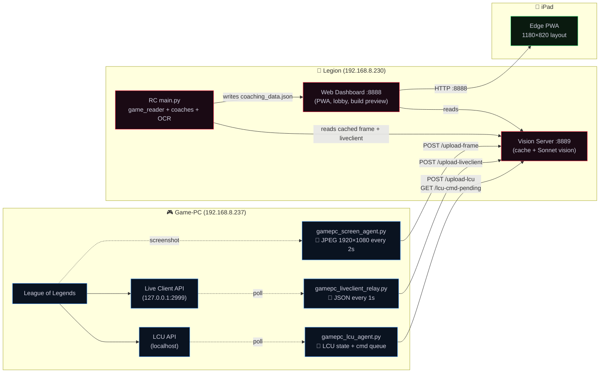
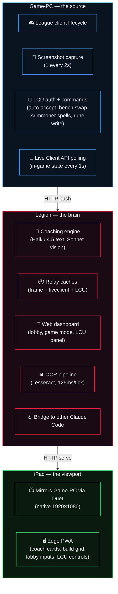
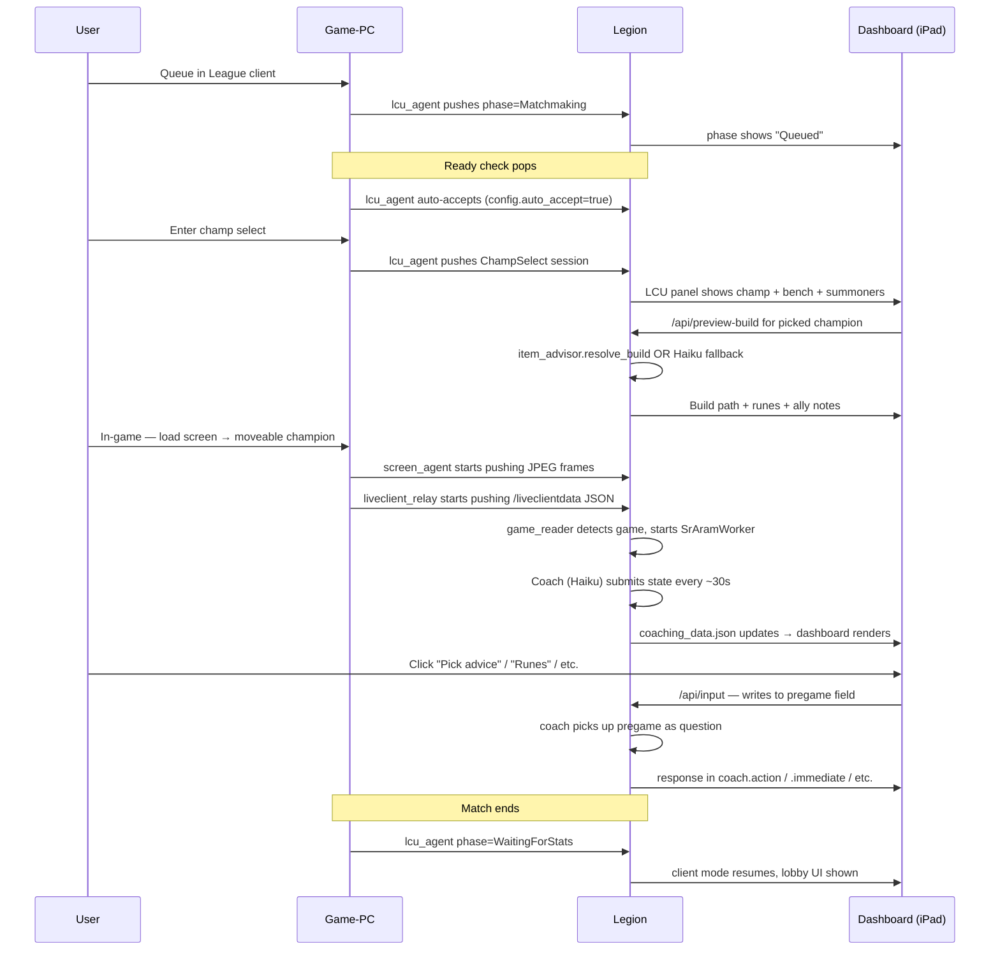

# Riot Commander — System Architecture (2026-04-20)

Three machines, five data flows, one dashboard.

## High-level flow

## What each machine owns

## Data flows — who talks to who

| From | To | Protocol | Purpose | Cadence |
|---|---|---|---|---|
| Game-PC `screen_agent` | Legion `:8889/upload-frame` | HTTP POST (JPEG b64) | Screenshots for vision + OCR | every 2s |
| Game-PC `liveclient_relay` | Legion `:8889/upload-liveclient` | HTTP POST (JSON) | Live game telemetry | every 1s |
| Game-PC `lcu_agent` | Legion `:8889/upload-lcu` | HTTP POST (JSON) | Champ-select, queue, lobby state | every 1s |
| Legion dashboard | Legion `:8889/lcu-cmd` | HTTP POST | Queue a command for LCU (accept, bench, runes) | on user action |
| Game-PC `lcu_agent` | Legion `:8889/lcu-cmd-pending` | HTTP GET | Drain queued commands | every 0.5s |
| iPad / browser | Legion `:8888/` | HTTP GET | Dashboard HTML + state polling | every 500ms |
| Both Claude Codes | Legion `:8888/api/bridge` | HTTP POST+GET | Cross-Claude activity log via hooks | per prompt |

## Process names (actual files on disk)

**Game-PC (`C:\RC-Agent\`):**
- `gamepc_screen_agent.py`
- `gamepc_liveclient_relay.py`
- `gamepc_lcu_agent.py`
- `bridge_fetch.py` / `bridge_post.py` (Claude Code hooks)

**Legion (`C:\Riot Commander\`):**
- `main.py` — RC orchestrator (poll loop, coaches)
- `web_dashboard.py` — `:8888` HTTP server
- `moon_vision_server.py` — `:8889` HTTP server (caches + Sonnet)
- `game_reader.py` — reads cached liveclient from vision server
- `coach_integration.py` — Haiku coaching (SR/Classic/Ranked)
- `core/sr_aram_worker.py` — background poll thread
- `coaches/aram_coach.py`, `brawl_coach.py`, `arena_coach.py`, `tft_coach.py`
- `core/vision_tesseract.py` — OCR pipeline
- `item_advisor.py` — curated builds + Haiku fallback + exclusions
- `data/item_exclusions.json` — Lord Dominik's vs Mortal Reminder mutex, etc.

## Key gotchas (learned the hard way)

1. **Riot's LCU and Live Client APIs are `127.0.0.1`-only.** They refuse LAN connections even when bound to `0.0.0.0`. Hence the relay pattern — agents on Game-PC POST to Legion.
2. **`iphlpsvc` portproxy self-loops** silently eat port 2999. Check `netsh interface portproxy show all` before anything else when Riot's API stops responding.
3. **Python 3.14+ on Windows defaults to cp1252 for stdout**, so agents with Unicode arrows crash on startup. Set `PYTHONUTF8=1`.
4. **HEADLESS mode disables tkinter overlays on Legion** (`_HEADLESS = True` in `app/_overlay_manager.py`) — web dashboard is the UI.
5. **Vision server hardcodes `image/png` media type**; screen agent sends JPEG. Use `"image/jpeg" if data.startswith("/9j/") else "image/png"` auto-detect.

## The full life of one match

## Adjacent tools

- **claude-usage-tray** — tray icon showing Claude API usage (installed on both Legion & Game-PC).
- **Duet Display** — iPad mirrors Game-PC screen over USB-C for the actual gameplay view.
- **Claude Code CLI** — running on BOTH Legion and Game-PC, coordinated via the bridge at `:8888/api/bridge` and `CLAUDE.md` files in each cwd.
